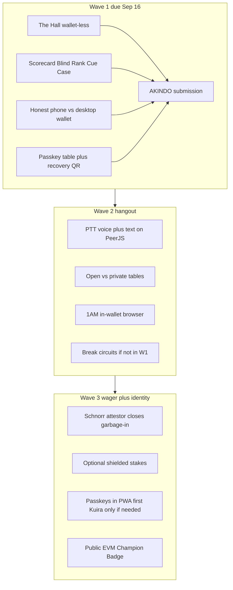

# Wave 1 submission, phone wallets, and the three-wave hangout

This is one product, three AKINDO waves. Wave 1 does **not** invent voice or tNIGHT wagers. It makes the Preview contract **visible and honest**, so Waves 2–3 add rooms and optional stakes on a table people already believe.

**Program (already in [PROJECT_LOG.md](PROJECT_LOG.md)):** Midnight Buildathon on [AKINDO](https://app.akindo.io/wave-hacks/jaMZjqPOBsLXvjdG). Grants $12.5k total. Wave 1 Aug 27–**Sep 16 15:00 UTC** ($3.5k). Wave 2 Sep 27–Oct 17 ($4k). Wave 3 Oct 27–Nov 16 ($5k), then Build Club. Judging weights from the Wave 1 sync: Engineering 40%, QA 15%, Product/Vision 15%, UX 15%, Communication 10%, BD 5%. They reward **visible iteration**, not a one-shot polish.

---

## How a phone talks to a Midnight wallet (the real answer)

A phone **does not** talk to the Lace **extension**. Lace Midnight injects `window.midnight` into **desktop Chrome/Brave/Edge**. iOS Safari and ordinary Android Chrome never load that extension, so **Connect Wallet will find nothing**. That is a platform limit, not a bug in this app.

| Surface | Play the game | Submit on Midnight |
|---|---|---|
| Desktop Chrome/Brave + **Lace Midnight extension** | Yes | **Yes** — this is the Wave 1 on-chain path |
| Desktop Chrome/Firefox + **1AM extension** | Yes | Yes in principle — we already enumerate every `window.midnight.*` in [src/midnight/chain.js](src/midnight/chain.js) / [src/midnight/wallet.js](src/midnight/wallet.js). Verify if time |
| Phone PWA / Safari / Android Chrome | **Yes** (mock / local progression) | **No** — no injected connector |
| Phone **inside 1AM’s in-wallet dApp browser** | Should play | **The actual mobile connector path** — 1AM injects `window.midnight['1am']`, has Preview, and a built-in dApp browser ([1AM developers](https://1am.xyz/developers), [Midnight community wallets](https://docs.midnight.network/sdks/community/wallets/community-wallets-overview)). Beta on iOS/Android |
| Lace **mobile app** (Play/App Store) | Unrelated | Cardano/Bitcoin today — **not** Midnight dApp connect |
| **Kuira** Android SDK (Sigil passkeys, on-device prove) | Would be a native app | Wave 3 companion at most — there is no PWA/web SDK |

Wave 1 UX (must ship with The Hall, not a new wallet):

- On a phone with no `window.midnight`: Connect Wallet explains **play works now**; on-chain needs **desktop Lace** or **open this URL inside 1AM**. Never imply Safari can sign.
- The Hall and explorers work on the phone with **zero wallet** — that is how a phone user *interacts with Midnight* in Wave 1: they **verify**, they do not **submit**.
- Do not spend Wave 1 building an embedded wallet. Kuira is Android-only alpha; `getProvingProvider` still cannot cross our worker (ADR-0018).

---

## Authentication vs reputation (phone PWA is not a throwaway)

Today there is **no login**. A “player” is three separate things that happen to live in one browser:

1. **Table** — nickname + `pool-profile` (level, wins, cues, coins) in localStorage ([src/profile.js](src/profile.js), [src/identity.js](src/identity.js)). This is what you see in the lobby. Every installed PWA / every browser is a **different table** until we sync it.
2. **Scorecard secret** — `mn-secret-key` (+ Compact private state `mn-private-state`). Circuits derive the on-chain map key from this secret ([src/midnight/hooks.js](src/midnight/hooks.js)). **This** is Midnight reputation, not the Lace address.
3. **Fee wallet** — Lace or 1AM. It pays DUST and submits the proved tx. A different Lace on another machine can still update the **same** Scorecard if it has the same `mn-secret-key`.

So: **playing only on the phone PWA does count** — locally, immediately (XP, wins, cues). It does **not** automatically appear on Midnight, and it does **not** appear on desktop Chrome, because those are other localStorage worlds. Without a link, the user would feel the PWA is a toy.

**Frictionless path (Wave 1 primary): the passkey is the player, the wallet is only the stamp.**

Daily UX should be Face ID / fingerprint / Windows Hello, not a PIN QR. That is the same idea as Kuira’s Sigil, done in the PWA with WebAuthn.

1. First open: **Continue** → `navigator.credentials.create` with the **PRF** extension and a fixed domain salt (`midnight-pool:sk`). HKDF that 32-byte PRF output into `mn-secret-key`. Same passkey + salt = same Scorecard forever.
2. Synced passkeys (iCloud Keychain, Google Password Manager) already copy that material to the user’s other devices. Phone PWA and desktop Chrome on the **same Apple or Google account** then derive the **same secret** with one biometric — no QR, no PIN, no seed.
3. Profile (coins, cues, wins) does not live in the passkey. Encrypt it with a key from the same PRF and PUT opaque ciphertext to a tiny blob API (`api/table.js` + Vercel KV, GCS fallback). Server never sees plaintext. **Locked for Wave 1:** this ciphertext blob is the happy path (not “wait until 1AM”). Other device: Continue → PRF → GET blob → decrypt → same lobby. WhatsApp/Confer pattern; secrets stay on device.
4. **QR + PIN stays as recovery only:** different Apple vs Google accounts, Windows Hello without PRF, a friend’s PC, lost passkey rotation. Not the happy path. Show a one-time recovery code when the passkey is created (lost authenticator = lost table unless they saved it — same as a wallet seed; be honest in UI).
5. Lace/1AM never become the Scorecard. If they did, desktop Lace and phone 1AM would be two reputations unless the user copies a 24-word seed — worse friction than a passkey. Wallet only pays DUST.
6. **Never auto-`commitStats` from a default level-1 profile.** Unlock passkey + merge blob first. Otherwise a desktop first-visit would overwrite a phone Scorecard with empty stats.

Support caveats (do not hide): PRF is solid on Android Chrome and iOS/Safari 18.4+; Windows Hello is still patchy (recovery QR for those users). Hybrid “scan QR on the phone to log into desktop” as a *passkey* ceremony must not be used for PRF on old iOS — platform passkeys only.

Kuira on Android is the native cousin of this exact design. We copy the architecture in the PWA rather than shipping two apps in Wave 1.

**Still true for Wave 1:** Safari still cannot *submit* a Midnight tx unless we add a house paymaster. The passkey table is the identity; **desktop Lace or 1AM’s dApp browser** is the stamp until Wave 2.

We will **not** custody per-user Midnight keys. Compact `commitStats` already keys reputation by `localSecretKey()`, not by the Lace address — so abstracted login (passkey) plus a later house fee-payer is enough. Midnight Passport / Turnkey embedded Midnight / Kuira-in-PWA are not shippable this wave (Passport announced, Turnkey partnership, Kuira Android-only). See the passkey-table plan for the full custody vs paymaster split.

---

## PWA vs native apps (Waves 2–3)

**Stay a PWA as the product.** Do not plan a rewrite into Android + iOS apps as the way we “get everything.” The hangout is one URL friends can tap; two native codebases would split the room and miss Wave 2.

What the PWA already can, or will, cover:

- Play, install, landscape, offline lobby
- Passkey identity + encrypted profile sync (above)
- Voice + chat on the existing PeerJS/WebRTC connection (foreground session — a pool rack is 10 minutes, not a background call)
- On-chain **verify** (The Hall) on every phone
- On-chain **submit** on a phone via **1AM’s in-wallet browser** (same HTTPS origin, same passkey RP id `midnight-pool-one.vercel.app` in the lucky case) or desktop Lace

What a native app is *for*, if we ever add one:

- **Kuira** — on-device proving so Cloud Run never sees witness inputs; Android-only alpha today
- App Store / Play discovery (a **Trusted Web Activity / Capacitor shell** around this same PWA, not a new game)
- Background audio if we ever want the table to keep talking with the screen off (iOS PWAs are weak here)
- A Midnight embedded wallet if 1AM’s dApp browser stays beta forever

Wave 2: prove 1AM-in-PWA-origin submit. If that works, native is optional. Wave 3: Capacitor wrapper only if we want store listing; Kuira only if we drop the hosted prover. Default answer to “will we able to have everything through the PWA?” — **yes for hangout + reputation + optional wagers**, with 1AM as the phone signer. Native is an enhancement, not the strategy.

---

## What other Midnight apps taught us (kept)

- Official **leaderboard**: wallet-less indexer UI. We invert the product (private rank) but copy the **verification surface**.
- **Lifeline**: never label mock as on-chain; live indexer in the UI.
- **Among-Midnight**: fire-and-forget hooks; game never waits. We already copied this; Wave 1 just makes the public half visible.
- **Sea Battle / Phantom Fleet**: prove the secret, do not publish it. Our secret is rating/cue/nonce, not 60fps physics.
- **ZK Loan / ProofVault**: Schnorr attestor. That is **Wave 3**, not Wave 1 (new Compact + Preview redeploy).
- **1AM**: in-wallet browser is how phones will submit before Kuira/PWA wallets exist. Wave 2 verifies that path; Wave 1 only documents it.

---

## Wave 1 stack — what we add and how (do this now)

No new Compact. No Preview redeploy. GCP/Vercel only if needed: indexer CORS (`api/ledger.js`) and/or an opaque table-blob store (ciphertext only — see passkey section).

### 1. The Hall (highest leverage)

Judges on a phone or a laptop without Lace currently see **zero chain**. The Rail is `localStorage` ([src/midnight/audit.js](src/midnight/audit.js)). `readState` in [src/midnight/chain.worker.js](src/midnight/chain.worker.js) already returns `statsCommitments` / `claimedCues` counts but only after wallet `ready`.

**Build:**

- New [src/midnight/ledgerPublic.js](src/midnight/ledgerPublic.js): `POST` `https://indexer.preview.midnight.network/api/v4/graphql` with the `contractAction` query from [docs/DEPLOYMENT.md](docs/DEPLOYMENT.md). Parse `__typename` + address. Optional second query for latest txs if the schema allows without the SDK.
- If the indexer has no CORS from `midnight-pool-one.vercel.app`, add [api/ledger.js](api/ledger.js) (Node, same family as [api/og.js](api/og.js); keep [api/invite.js](api/invite.js) as-is). Tiny proxy, cache ~15s.
- UI: a **Hall** entry on the lobby or Settings (new modal in [index.html](index.html), strings in [src/i18n.js](src/i18n.js), render in [src/main.js](src/main.js)). Show contract address, Preview network, explorer links (midnightexplorer + Subscan), deploy/`commitStats`/`proveThreshold` tx ids from [contracts/preprod/deployed.json](contracts/preprod/deployed.json), live `contractAction` type, and “this is public; levels are not here.”
- The Rail: if `disclosed.txId` exists, link it. Label `mode: 'real'` vs `'mock'` the way Lifeline does.
- Fix Champion Badge copy (`championHint` still says no chain submission).

**Demo clip:** open PWA on a phone, open The Hall, tap explorer. No wallet.

### 2. Demo loop for the three live circuits

After successful connect in [src/main.js](src/main.js) (~line 1479): if the passkey table is unlocked and the profile is not a virgin default, fire-and-forget `mnHooks.hookCommitStats(profile)`. Never commit empty stats over a real table. League checks already hit `proveThreshold`. Hide or hard-confirm **Deploy new**. Stale comment in [src/midnight/wallet.js](src/midnight/wallet.js) (“submission not wired”) gets fixed.

### 3. Phone/wallet copy (required)

Detect missing connector vs connected. Copy in i18n, EN+ES. Phone: **Continue** (passkey) + play + Hall. Desktop: Continue (same passkey) + Connect Lace to stamp. One line for 1AM in-wallet browser. Recovery QR in Settings, not on first run.

### 4. Passkey table (required) — QR is recovery only

See authentication section. [src/midnight/passkeyTable.js](src/midnight/passkeyTable.js) (PRF + HKDF), blob PUT/GET, Settings recovery. ADR-0020. Happy-path demo: play on phone (Continue) → desktop Chrome Continue → same lobby → Lace → Hall.

### 5. Optional same-day: The Rack on the existing contract

Only after The Hall works. Add `commitBreakChoice` / `revealBreakChoice` / `resolveBreak` to `ON_CHAIN` in [src/midnight/hooks.js](src/midnight/hooks.js). Keys already in `public/midnight/keys/`. P2P still decides `game.turn`. Incomplete if the opponent has no wallet — label it. This is the Wave 2 default if time dies on Sep 16.

### 6. Document the arc + gear up submission

- New [docs/WAVES.md](docs/WAVES.md): the three-wave story below, phone/wallet matrix, what is in/out of Wave 1. Link from README and HUSTLE_PROTOCOL roadmap.
- [demo-script.md](demo-script.md): phone play (passkey Continue) → Hall (no wallet) → desktop Continue (same table) → Lace Scorecard → Hall updates. Name **Midnight Buildathon / AKINDO**. Recovery QR only if asked.
- **Submit:** public repo (push `main` if origin is behind), ≤2 min video, AKINDO by **Sep 16 15:00 UTC**. Redeploy Vercel after The Hall + passkey table land.

**Wave 1 success:** a stranger with only a phone can verify the Preview contract; the same human can Continue on phone and desktop with one biometric and, with Lace, stamp **that** record on-chain.

**Wave 1 will not:** voice, chat, tNIGHT wagers, Kuira, Effectstream public mint, new Compact, stakes.compact deploy.

---

## Wave 2 (Sep 27–Oct 17) — the hangout

Goal: people come to **sit at a table**, not to click Prove. AKINDO wants visible iteration: the same Preview contract, new social surface.

- **Voice + text in the room.** WebRTC already carries the match ([src/net.js](src/net.js) PeerJS). Add an audio track (push-to-talk, mute) and a small data-channel chat. **Table private** (invite/QR) vs **table open** (Quick Match: no open mic — that is the product rule from [hackathon.md](hackathon.md)).
- **1AM mobile submit and/or house paymaster.** Same passkey table on the phone. Either open the live URL in 1AM’s dApp browser so **that device** can `commitStats`, or run one funded Preview wallet (the deploy wallet) as a fee-payer that submits after Continue — user never holds a Midnight key we store. Confirm `detectWallets()` sees `1am`. Prove via existing Cloud Run prover. Do **not** mint per-user custodial seeds.
- **Finish The Rack on-chain** if Wave 1 skipped it. Live Hall via indexer WS (Q&A dashboard pattern).
- **Practice-coin Sealed Table** optional: deploy `stakes.compact` to Preview and wire `attestResult` fire-and-forget. Still **not** tNIGHT. Write-once match record so a silent host cannot overwrite.
- **Clubs v0** on the existing relay (`server/`): named tables, not a public ELO dump. Rank to a club is still `proveThreshold`, not a leaderboard of numbers.

Wave 2 is still Midnight-aligned: chat/voice never go on-chain; the chain stays the tamper-evident rank/fairness layer.

---

## Wave 3 (Oct 27–Nov 16) — hang, then maybe wager

Goal: a genuine place to **hang and optionally wager a game or two**, without turning the hall into a casino or a public bankroll.

- **Garbage-in closed:** Schnorr-on-Jubjub attestor like [ZK Loan](https://docs.midnight.network/examples/dapps/zkloan). Relay already HMAC-signs `(pk, level, wins)` ([server/attest.js](server/attest.js), [ADR-0009](docs/adr/0009-match-result-attestation-backend.md)). Wave 3 verifies that signature **in Compact** so `commitStats` cannot be a typed-in fantasy. This is a **new circuit + Preview (or Preprod) redeploy** — budget the 11-minute WalletFacade sync and The Hall address update.
- **Optional shielded stakes:** tNIGHT/DUST behind `proveThreshold` (you must qualify to sit at a stakes table). Amounts hidden from the rail, equality proved (Sealed Wager in HUSTLE_PROTOCOL). **Never required to play.** Practice coins stay the default.
- **Called Shot** if time: commit pocket before the balls move; opponent’s copy makes it non-trivial.
- **Blind Handicap:** matchmaking by skill **band** without the relay learning a rating.
- **Identity:** keep the passkey table as canonical. Do not mint a second reputation inside Kuira; if a native shell appears, it must use the same RP id / secret derivation. QR remains disaster recovery.
- **Cross-chain:** Champion Badge on a **public** EVM testnet joined off-chain (Effectstream if it boots; otherwise the same no-bridge script we already have). Deferred from Wave 1 on purpose.
- **Mainnet** only if Preview usage is real and dust/fees are sane — otherwise stay Preview/Preprod and say so.

Wagering stays rational privacy: observers see that a stake existed and who attested first; they do not see bankroll or exact rating.

---

## Product north star (all three waves)

Midnight Pool is a **room on a privacy network**: install, shoot pool, talk, prove you belong at a ranked table without doxxing your record, and only then optionally wager. Voice/chat are how it becomes a hangout. Midnight is how the hangout is not a spreadsheet. The Wave 1 Hall is the public door to that room.
