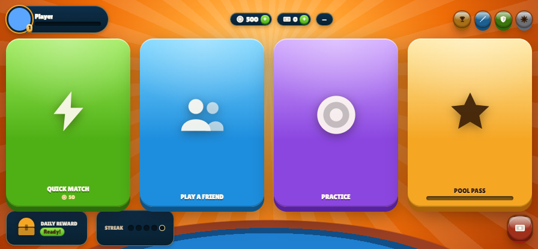

# Midnight Pool

[](https://midnight-pool-one.vercel.app/)



Midnight Pool is a mobile-first 8-ball pool PWA built from the ground up around one idea: a pool
hall is a hangout, not a spreadsheet. You install it on your phone, play solo or against friends
and strangers with real physics and real-time peer-to-peer multiplayer, and level up through a full
progression system — while every privacy-sensitive part of that progression (your rank, your
cosmetics, your match outcomes) runs on genuine Midnight Network zero-knowledge circuits instead of
a public leaderboard. Nothing about your exact stats ever has to leave your device to prove you
belong at the table.

Built for the [Midnight Hackathon (MLH, Aug 2026)](https://midnight-hackathon-august-2026.devpost.com/)
across all three tracks it targets — Mobile, Integrate Midnight, and Cross-Chain. See
[`hackathon.md`](hackathon.md) for the full submission writeup.

## Features

**Play**
- Solo practice, invite-a-friend (4-letter code / share link / QR), and Quick Match against a
  random opponent — peer-to-peer over PeerJS, a lightweight WebSocket relay only for pairing.
- Real physics (collisions, friction, spin/English, pockets) and standard 8-ball rules, including
  an open table until the first legal pot decides groups.
- English and Spanish, installable as an offline-capable app, locked to landscape, touch-first HUD.

**Progression**
- Coins/Cash economy, XP and levels, a daily login reward, a Pool Pass, cue collections unlocked
  from loot boxes, and a Loyalty Shop.
- Win/loss record, win-rate, and lifetime winnings tracked alongside the classic economy.
- Five league divisions (Brass → Bronze → Silver → Gold → Diamond), gated on level or wins.

**Midnight privacy layer — [the Hustle Protocol](docs/HUSTLE_PROTOCOL.md)**

*Hide the player, prove the play.* In a real pool hall the hustler hides how good they are; online
pool inverted that, making your rating public while the cheating stays hidden. This puts it back the
right way round — and [says plainly what it does not fix](docs/HUSTLE_PROTOCOL.md#trust-model--including-what-this-does-not-fix).

- **Private ranked credentials** — your level and win count live as an on-chain commitment on
  Midnight **Preview**; entering ranked Quick Match or unlocking a league badge runs a real
  threshold-proof circuit that discloses only *yes/no*, never the number. Independently verifiable
  on the public indexer ([docs/DEPLOYMENT.md](docs/DEPLOYMENT.md)).
- **Soulbound cosmetics** — cue tiers are claimed through a nullifier-based circuit: claimable once,
  untradeable, and nobody else learns which cue you unlocked.
- **Provably fair break** — both players commit and reveal a nonce over the existing peer
  connection (so the rack starts instantly). The same relation exists as Compact circuits; the live
  path does not wait on a block.
- **Match stakes** in practice Coins, with a write-once Compact design so a losing host can't
  overwrite an honest result by going silent. Implemented and tested; not yet on the Preview
  contract or the browser submit path.
- **Guest-side physics verification** — the guest independently replays the host's shot from the
  same snapshot and inputs and flags any mismatch, closing the "host fabricates the outcome" gap.
- **Server-signed stat receipts** — once both peers agree on a match result, either side can fetch
  an HMAC-signed receipt to disclose alongside the on-chain commitment.
- **Cross-chain Champion Badge** — a rank proven privately on Midnight can mint a badge on a real
  EVM contract, with no bridge and no custody: both chains are read independently and joined by a
  shared key in a script. Two versions exist — one runs the Midnight side through the compiler's
  simulator (fast, no network needed), the other does a genuine `deployContract`/`callTx` against a
  running local Midnight network (real ZK proof, real transaction, real block confirmation). This
  mint is **not** on Preview; the live chain path is Scorecard / Blind Rank / Cue Case.
- A local audit dashboard (The Rail) shows every one of the above as it happens, in-app, and real
  submits include a transaction id.

Every Midnight feature is designed to never block gameplay: a missing or slow wallet falls back to
a fast local mock instantly, so a shot never waits on a proof server. On-chain submission from the
live PWA needs **desktop Chrome/Brave + Lace on Preview + tDUST**; phones can play and install the
PWA, they cannot yet submit (no Lace in iOS Safari / typical Android Chrome).

## How to play

Drag from the cue ball and release to shoot — the further you pull, the more power. Equipped cues
above the starting House Cue unlock a small spin/English control (the 3×3 grid near the power bar).
Progression, cues, the daily reward, the Pool Pass, and the Loyalty Shop are reachable from the
icons under Play on the main menu; leagues and the Midnight settings panel (wallet connect, audit
log, Champion Badge) are alongside them.

## Project structure

```
src/                     game client
  config.js                constants (table, balls, physics, spin model)
  physics.js               custom billiards engine (collisions, friction, pockets, spin/English)
  rules.js                 8-ball rule engine (fouls, group assignment, win/loss)
  scene.js                 PixiJS rendering
  net.js                   peer-to-peer multiplayer (PeerJS) + matchmaking relay client
  identity.js              local nickname, avatar, preferences
  profile.js               persistent progression state (coins, cash, xp, cues, record, pass)
  economy.js               XP curve, per-match currency awards, win-rate/lifetime winnings
  cues.js                  cue collections/tiers and their stat effects
  leagues.js               league tier definitions (Brass -> Diamond)
  dailyReward.js           daily login streak and rewards
  pass.js                  Pool Pass tiers and free/premium rewards
  lootbox.js               Silver/Gold/Diamond box reward tables
  loyalty.js               Loyalty Shop catalog and redemption
  audio.js                 sound effects
  ui.js                    menu, HUD and dialogs
  i18n.js                  translations
  pwaInstall.js            install-on-your-phone prompt (Android beforeinstallprompt / iOS instructions)
  main.js                  game loop, input, turns, and menu wiring
  midnight/                Midnight integration (see below)
    hooks.js                 fire-and-forget bridge into the compiled contract, mock-mode by default
    wallet.js                window.midnight / DApp Connector wallet detection
    circuit.js                real client-side circuit execution (compact-runtime WASM) for the browser
    breakOrder.js             P2P commit-reveal for who breaks, mirrored on-chain
    physicsVerify.js          guest-side deterministic shot replay + diff
    attest.js                 client for the relay's match-attestation + signed-receipt endpoints
    audit.js                 local append-only activity log

contracts/               Compact smart contracts
  midnight-pool.compact    stat commitment, threshold credentials, soulbound cues, fair break order
  stakes.compact           match-stakes escrow / attestation record
  witnesses.ts             TypeScript witnesses (private state) for midnight-pool.compact
  test/                    simulator-executed circuit tests
  cross-chain-join.ts      fast Midnight <-> EVM join (simulator + real anvil mint)
  testnet-wallet.ts        a real Preprod wallet-sync attempt, kept as a documented starting point
  devnet-deploy/           isolated package: real deployContract/callTx against a local Midnight
                           network, plus a fully-real cross-chain-join-real.ts

cross-chain/              standalone Foundry project (ChampionBadge.sol) for the EVM side

server/                   matchmaking relay + match-result attestation backend (Cloud Run)
  matchmaker.js              pairing logic for Quick Match
  db.js / attest.js         SQLite attestation store + HMAC-signed stat receipts

api/                      Vercel serverless functions (dynamic share previews)
docs/adr/                 architecture decision records — the reasoning behind every design choice
```

## Development

```bash
npm install
npm run dev      # start the dev server
npm test         # run all the pure-module self-tests (physics, rules, economy, leagues, ...)
npm run build    # production build
```

Quick Match and match attestation need the relay running locally too (separate process, separate
`package.json`):

```bash
cd server
npm install
npm start        # listens on :8787 by default
npm test
```

The Compact contracts and their simulator tests live under `contracts/` (see
[`contracts/README.md`](contracts/README.md) for the circuit table). The Compact CLI is Linux/macOS
only, so the build runs in Docker and is reproducible anywhere:

```bash
bash scripts/compact-docker/compile.sh
```

Real on-chain submission happens in the browser through the DApp Connector, with midnight-js and the
ledger WASM confined to a Web Worker so nothing can stall the 60Hz physics loop
([ADR-0018](docs/adr/0018-real-browser-submission.md)). The compiler is pinned to 0.31.1 because it
is the only one whose runtime (0.16.0) and ledger (8.0.2) the released midnight-js 4.1.1 can deploy —
measured, not inferred ([ADR-0016](docs/adr/0016-one-released-midnight-stack.md)).

[`docs/DEPLOYMENT.md`](docs/DEPLOYMENT.md) is the end-to-end path to the public Preview contract,
who can submit from the live PWA (desktop Lace; not yet mobile wallets), Vercel vs GCP limits, and
the commands **anyone can run to verify the contract without trusting this repo**.

## Documentation

- [`docs/HUSTLE_PROTOCOL.md`](docs/HUSTLE_PROTOCOL.md) — what the privacy layer proves, where the
  chain/peer-to-peer line sits, and a trust table whose right-hand column is the limits.
- [`docs/DEPLOYMENT.md`](docs/DEPLOYMENT.md) — deploying to a public testnet, and verifying it
  independently.
- [`docs/adr/`](docs/adr/) — every architectural decision, written before the change, including the
  honest limitations of each Midnight feature (what a proof does and doesn't guarantee).
- [`PROJECT_LOG.md`](PROJECT_LOG.md) — living record of project state, updated each session.
- [`hackathon.md`](hackathon.md) — the full Devpost submission writeup: inspiration, architecture,
  challenges (including a real upstream SDK bug we root-caused and
  [filed](https://github.com/midnightntwrk/midnight-wallet/issues/704)), and what's next.
- [`demo-script.md`](demo-script.md) — the timed ~2-minute voiceover script used for the hackathon
  demo video.
